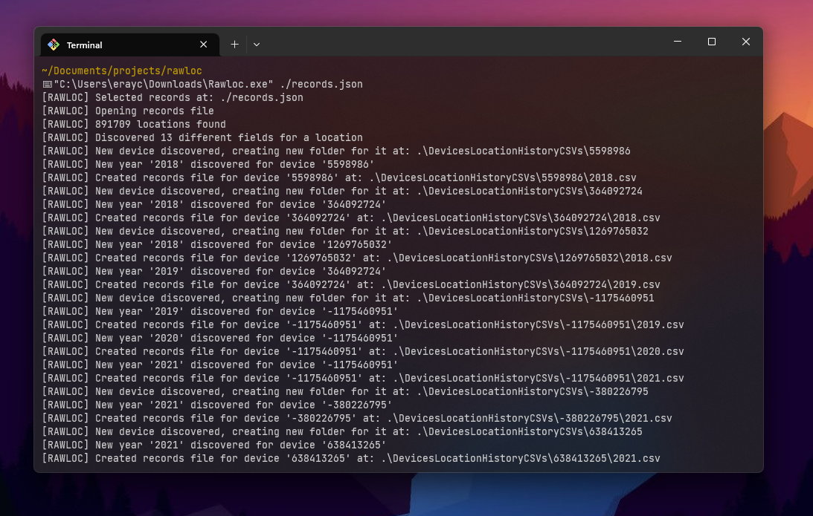

# Rawloc

This small program parses a `Records.json` file belonging to [Location History](https://locationhistoryformat.com/reference/records/), which is exported from a Google Takeout. It breaks down and categorises years worth of location history data into managable csv files that can then be used in other programs, such as, [Excel](https://www.microsoft.com/en/microsoft-365/excel).

The following is an example of the output folder structure to expect after parsing a `Records.json` file:

```
├── DevicesLocationHistoryCSVs
│   ├── {deviceTag1}
│   │   ├── 2023.csv
│   │   ├── 2022.csv
│   ├── {deviceTag2}
│   │   ├── 2021.csv
```

## Preview



## Usage

This is a portable binary _(.exe)_ meaning it does not come with any installation or extra steps.

1. Download the release build.
2. Run in terminal:

```bash
./rawloc.exe <path_to_records_file>
```

Running the program will generate a `DevicesLocationHistoryCSVs` directory at the same location where the `Records.json` file is located.

## Contributing

This section is intended as a guide for people who want to locally build the program and/or contribute to the source code.

C++ was chosen as it is seems favourable when it comes to processing large data files. Furthermore, a binary can be generated that can be easily distributed across systems that require the functionality, specifically for Windows. Interacting with JSON files does not come natively out of the box, therefore, the following open-source external dependency is used: [yyjson](https://github.com/ibireme/yyjson).

No package manager has been used as it introduces more complexity to the codebase and the program does not rely on many external dependencies.

### Setup

1. Clone the [yyjson](https://github.com/ibireme/yyjson) repository and save to your external dependencies folder.
2. Compile a release of the repository. 
3. Add the path of the repository to the `Additional Include Directories` under `Rawloc > Properties > C/C++ > General`.
4. Add the path to the `yyjson.lib` to the `Additional Dependencies` under `Rawloc > Properties > Linker > Input`.

You should be good to go now to build `Rawloc` locally.
